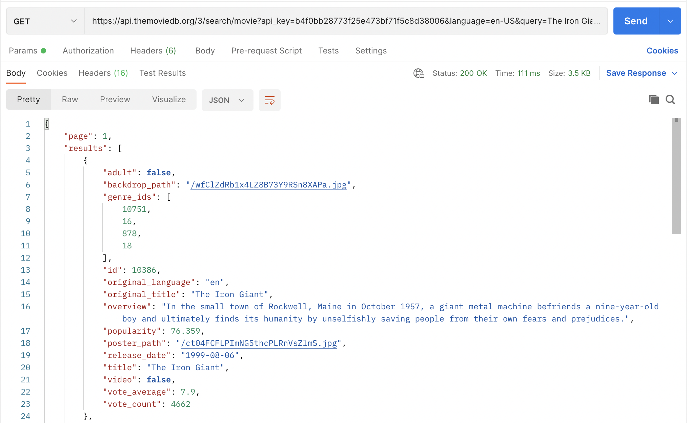

# Personal Project Proposal
The personal project I will be working on is a movie information site that pulls from The Movie DataBase (themoviedb.org). The site will make use of the TMDB public API (https://developers.themoviedb.org/getting-started/getting-started/authorization), which allows users to search for a movie by its title and retrieve all pertinent information (movie title, director, release date, runtime, rating, actors, synopsis, as well as where it's available to watch/stream).
The splash page of the site will either fetch a random movie, a list of recent releases, or a list of upcoming movies. On this page, users will be able to search for a movie by title to retrieve the information listed above. Additional features that I would like to include should I be able to implement basic functionality will include:
- searching for television series
- searching for genres
- a random movie suggestion based on certain search criteria (genre, rating, director)

## Sample Fetch Request
